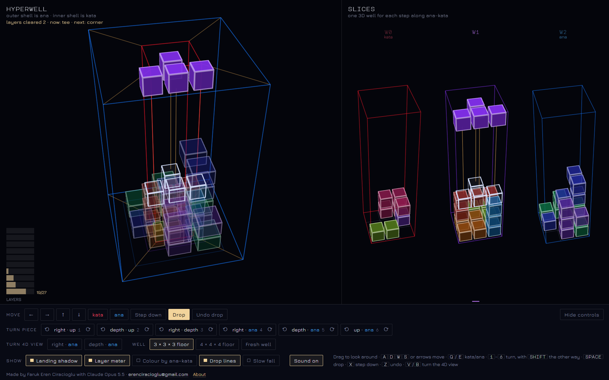

# Hyperwell

**Play it:** https://erenciracioglu-dotcom.github.io/Hyperwell/

A calm falling-block puzzle with one more direction. The floor of the well is a whole cube, so a layer only clears when every one of its cells is filled, across every step of ana and kata (the two ways along the fourth direction). Pieces turn in planes, a quarter turn at a time. Nothing falls until you drop it, and you can undo your last drop, so take your time.

You see the well two ways at once. The left view draws it like a tesseract: cells toward ana sit in the outer shell, cells toward kata in the inner one. The right view cuts the same well into ordinary 3D slices, one for each step along ana–kata.

The first puzzle is set up for you: the bottom layer has one gap, and the first square only fits after a turn in depth · ana.

It is the sibling of [Tesseracting](https://github.com/erenciracioglu-dotcom/Tesseracting), a ball bouncing inside a turning tesseract.

Best on a desktop browser with a keyboard; every move also has a button.

## Controls

- Drag to look around; the mouse wheel zooms.
- A and D (or left and right) move the piece right and left on screen; W and S (or up and down) move it away and closer. Q and E move it toward kata and ana.
- Keys 1 to 6 turn the piece a quarter turn in one of six planes: right · up, depth · up, right · depth, right · ana, depth · ana, up · ana. Hold Shift to turn the other way.
- Space drops the piece, X steps it down one cell, Z undoes the last drop.
- V and B turn the whole 4D view a quarter turn in right · ana or depth · ana, so what was ana now points right or away.
- N starts a fresh well.

## The switches

- **Landing shadow**: where the piece will land. On at the start.
- **Layer meter**: how full each layer is. On at the start.
- **Colour by ana–kata**: colours every cell by where it sits along the fourth direction, from kata red to ana blue.
- **Drop lines**: lines from each cell of the piece down to where it lands.
- **Slow fall**: the piece sinks one cell every couple of seconds, for when you want a little pressure.
- **Well**: a 3 × 3 × 3 floor (27 cells per layer) or a 4 × 4 × 4 floor (64 cells per layer).
- **Sound**: small sounds for moves, turns, drops and cleared layers. Off at the start.

## Some things to notice

- A four-cell piece can never reach into all four directions, so every piece is a 3D shape. The fourth direction only shows up in how it can turn.
- In 3D, two of the twisted pieces are mirror images that no turn can match. In 4D a turn can flip one into the other, so there is only one twist.
- A turn in a plane leaves the other two directions alone. Turning in right · ana does not move the piece up or in depth, apart from a small nudge when it would hit a wall.

## How it works

Everything runs in the browser from a single HTML file with plain WebGL 2, no libraries. The left view keeps height as it is and draws the floor cube with a perspective along ana–kata, so each step toward ana is a larger shell. Turns are animated as real 4D rotations about one cell of the piece, then snapped to the grid, with small nudges when a turn would hit a wall.

## Credits

Made by Faruk Eren Ciracioglu with Claude Opus 5.5.
Contact: erenciracioglu@gmail.com

## License

MIT. See [LICENSE](LICENSE).
